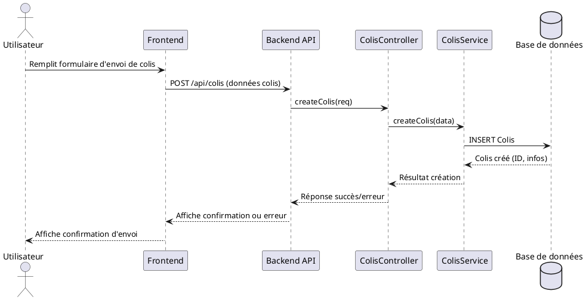
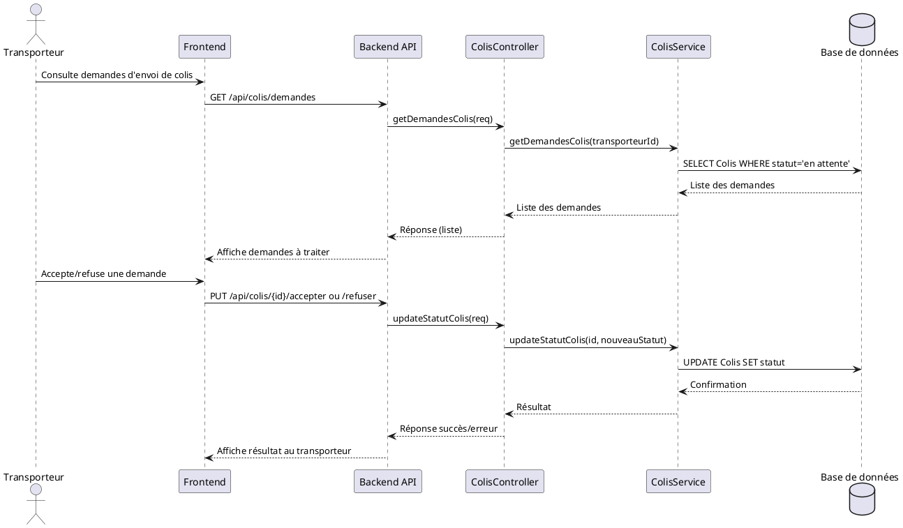
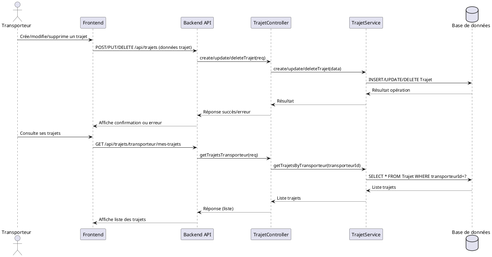
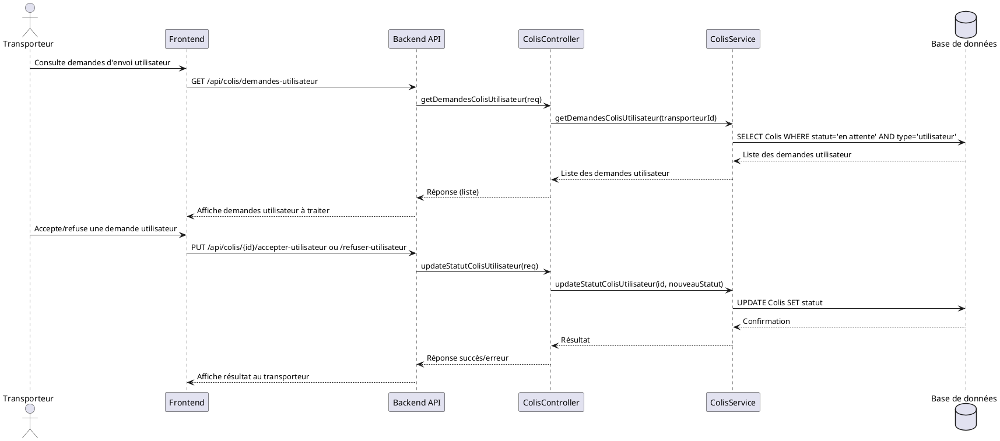
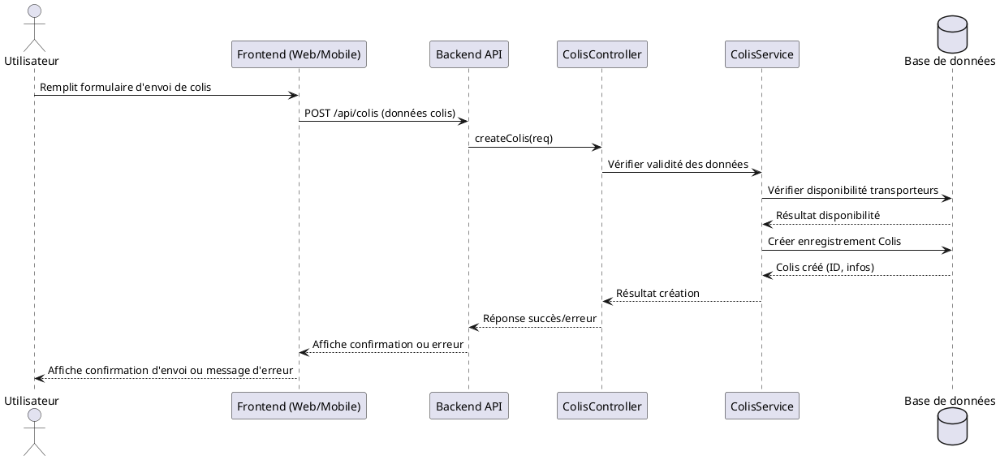
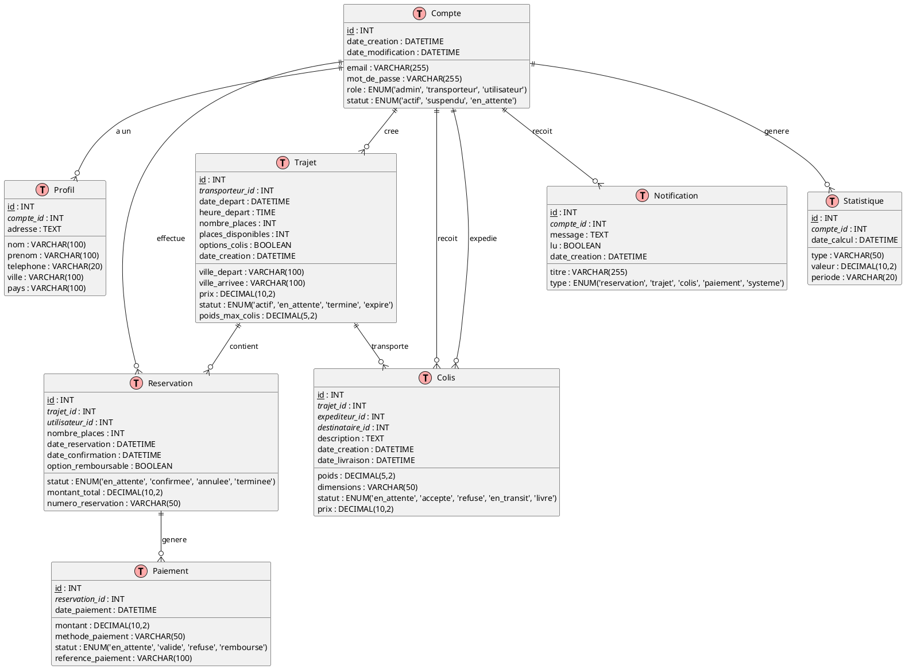

Bien sûr ! Voici une **documentation détaillée** de ton projet BilletTigue, structurée pour couvrir l’architecture, les fonctionnalités, les technologies, les flux principaux, et des conseils pour la maintenance et l’évolution.

---

# Documentation Complète du Projet BilletTigue

## 1. Présentation Générale

**BilletTigue** est une plateforme de gestion de réservations de trajets, colis et clients, destinée aux transporteurs, administrateurs et utilisateurs finaux. Elle propose :
- Un **backend Node.js/Express** pour l’API et la logique métier.
- Un **frontend web** moderne (HTML/CSS/JS) pour les interfaces administrateur et transporteur.
- Une **application mobile Flutter** pour les utilisateurs.
- Une base de données relationnelle (probablement PostgreSQL ou MySQL, via Sequelize).

---

## 1.1. Présentation modulaire du projet

Le projet BilletTigue est conçu de façon **modulaire** pour garantir la clarté, la maintenabilité et l’évolutivité. Chaque module a un rôle précis et communique avec les autres via des interfaces bien définies.

### Modules principaux

- **Backend** (`backend/`)
  - Fournit l’API REST, la logique métier, la gestion de la base de données et la sécurité.
  - **Sous-modules** :
    - `controllers/` : Logique de traitement des requêtes API.
    - `models/` : Modèles de données Sequelize (Trajet, Compte, Colis, etc.).
    - `services/` : Logique métier réutilisable (statuts, statistiques, notifications, etc.).
    - `middlewares/` : Authentification, autorisation, validation.
    - `routes/` : Définition des endpoints API.
    - `migrations/` & `seeders/` : Évolution et initialisation de la base de données.
    - `utils/` : Fonctions utilitaires partagées.
    - `config/` : Paramètres de connexion, configuration générale.

- **Frontend Web** (`web/`)
  - Interface utilisateur pour les admins et transporteurs, accès via navigateur.
  - **Sous-modules** :
    - `pages/` : Pages HTML (dashboards, login, gestion, etc.).
    - `src/js/` : Scripts JavaScript pour l’interactivité, l’appel API, la gestion des modales, la pagination, etc.
    - `public/assets/` : Feuilles de style CSS, images, icônes, ressources statiques.
    - `docs/` : Documentation spécifique au frontend.

- **Application Mobile** (`mobile/`)
  - Application Flutter pour les utilisateurs finaux (Android/iOS).
  - **Sous-modules** :
    - `lib/` : Code Dart principal (UI, contrôleurs, services).
    - `android/`, `ios/` : Plateformes natives.
    - `test/` : Tests unitaires et widget.
    - `pubspec.yaml` : Dépendances et configuration Flutter.

- **Scripts** (`scripts/`)
  - Automatisation des tâches d’administration (sauvegarde, restauration, migration, etc.).
  - **Exemples** :
    - `backup-database.js` : Sauvegarde de la base.
    - `restore-database.js` : Restauration.
    - Fichiers batch/shell pour le lancement rapide.

- **Documentation** (`docs/`)
  - Centralise toute la documentation technique, fonctionnelle, guides d’utilisation, schémas UML, etc.
  - **Exemples** :
    - `DOCUMENTATION_BACKEND.md` : Détails sur l’API backend.
    - `DOCUMENTATION_BASE_DE_DONNEES.md` : Schéma de la base.
    - `GUIDE_DEPLOIEMENT_ADMIN_TRANSPORTEURS.md` : Procédures de déploiement.
    - Diagrammes de flux, de composants, de séquence, d’activité, de cas d’utilisation…

### Interactions entre modules

- Le **frontend web** et l’**application mobile** communiquent avec le **backend** via l’API REST sécurisée.
- Les **scripts** interagissent principalement avec la base de données et le backend.
- La **documentation** accompagne chaque module pour faciliter la prise en main, la contribution et la maintenance.

---

## 1.2. Fonctionnalités par acteur et organisation modulaire

Le projet BilletTigue propose des fonctionnalités adaptées à chaque type d’acteur. Voici un panorama détaillé :

### A. Fonctionnalités par acteur

#### 1. Administrateur
- Gestion des comptes transporteurs et utilisateurs (validation, suspension, suppression)
- Gestion des rôles et permissions
- Supervision des trajets (création, modification, suppression, validation)
- Supervision des réservations (vue globale, annulation, statistiques)
- Gestion des colis (suivi, litiges)
- Accès à toutes les statistiques (trajets, réservations, revenus, activité)
- Gestion des notifications système
- Gestion des paramètres globaux de la plateforme
- Accès aux rapports et exports de données

#### 2. Transporteur
- Authentification et gestion du profil
- Création, modification, suppression de trajets
- Gestion des statuts de trajets (actif, en attente, terminé, expiré)
- Gestion des réservations sur ses trajets (validation, annulation, historique)
- Gestion des colis associés à ses trajets
- Consultation des statistiques personnelles (trajets, réservations, revenus)
- Notifications sur les événements importants (nouvelles réservations, annulations, etc.)
- Accès à l’historique de ses activités

#### 3. Utilisateur / Client
- Inscription, connexion, gestion du profil
- Recherche de trajets (filtres, tri, pagination)
- Réservation de places sur un trajet
- Paiement en ligne (si activé)
- Suivi de ses réservations (historique, annulation)
- Suivi de colis envoyés ou reçus
- Notifications (confirmation, rappel, annulation)

---

### B. Organisation textuelle des fonctionnalités par module

#### 1. Backend / API
Le backend centralise toute la logique métier et la gestion des données. Il expose des endpoints sécurisés pour :
- L’authentification, la gestion de session et des rôles (pour tous les acteurs)
- La gestion des comptes, profils, et permissions (admin, transporteur, utilisateur)
- La création, modification, suppression et consultation des trajets (admin, transporteur)
- La gestion des réservations : création, validation, annulation, historique (tous acteurs selon droits)
- La gestion des colis : suivi, affectation, litiges (admin, transporteur, utilisateur)
- Le calcul et la fourniture des statistiques (admin : global, transporteur : personnel, utilisateur : historique)
- La gestion des notifications (création, envoi, consultation)
- La gestion des paiements (création, validation, historique)
- L’export de rapports et la supervision globale (admin)

#### 2. Frontend Web
Le frontend web propose des interfaces dédiées :
- **Pour l’administrateur** :
  - Tableaux de bord globaux (statistiques, supervision)
  - Gestion des comptes, trajets, réservations, colis
  - Accès aux rapports, exports, paramètres avancés
- **Pour le transporteur** :
  - Tableau de bord personnel (statistiques, notifications)
  - Gestion de ses trajets (création, modification, suppression, statuts)
  - Gestion de ses réservations (validation, annulation, historique)
  - Gestion des colis associés à ses trajets
  - Gestion du profil
- **Pour l’utilisateur** : accès limité (principalement via mobile)

#### 3. Application Mobile (Flutter)
L’application mobile est centrée sur l’utilisateur/client final :
- Inscription, connexion, gestion du profil
- Recherche de trajets, réservation, paiement en ligne
- Suivi de ses réservations (historique, annulation)
- Suivi de colis envoyés ou reçus
- Notifications en temps réel (push)
- Consultation de l’historique personnel

**Remarque :** Certaines fonctionnalités avancées (création de trajets, supervision globale, exports) sont réservées au web/admin, tandis que l’application mobile se concentre sur l’expérience utilisateur finale.

---

## 1.3. Détail des fonctionnalités, modules et mapping technique

### A. Liste exhaustive des fonctionnalités par acteur

#### Administrateur
- Gestion des comptes (création, validation, suspension, suppression)
- Gestion des rôles et permissions
- Supervision des trajets (création, modification, suppression, validation)
- Supervision des réservations (vue globale, annulation, statistiques)
- Gestion des colis (suivi, litiges)
- Accès à toutes les statistiques (trajets, réservations, revenus, activité)
- Gestion des notifications système
- Gestion des paramètres globaux de la plateforme
- Accès aux rapports et exports de données

#### Transporteur
- Authentification et gestion du profil
- Création, modification, suppression de trajets
- Gestion des statuts de trajets (actif, en attente, terminé, expiré)
- Gestion des réservations sur ses trajets (validation, annulation, historique)
- Gestion des colis associés à ses trajets
- Consultation des statistiques personnelles (trajets, réservations, revenus)
- Notifications sur les événements importants (nouvelles réservations, annulations, etc.)
- Accès à l’historique de ses activités

#### Utilisateur / Client
- Inscription, connexion, gestion du profil
- Recherche de trajets (filtres, tri, pagination)
- Réservation de places sur un trajet
- Paiement en ligne (si activé)
- Suivi de ses réservations (historique, annulation)
- Suivi de colis envoyés ou reçus
- Notifications (confirmation, rappel, annulation)

---

### B. Tableau de correspondance fonctionnalités / modules / technique

| Fonctionnalité                                 | Module           | Acteur         | Route (exemple)                                 | Controller                | Service                    |
|------------------------------------------------|------------------|----------------|-------------------------------------------------|---------------------------|----------------------------|
| Inscription utilisateur                        | Authentification | Utilisateur    | POST /api/auth/register-user                    | authController            | authService                |
| Inscription transporteur                       | Authentification | Transporteur   | POST /api/auth/register-transporter             | authController            | authService                |
| Connexion utilisateur/transporteur/admin       | Authentification | Tous           | POST /api/auth/login-user, /login-transporter   | authController            | authService                |
| Déconnexion                                   | Authentification | Tous           | POST /api/auth/logout                           | authController            | authService                |
| Création de trajet                            | Trajets          | Transporteur   | POST /api/trajets                               | trajetController          | (direct via modèle)        |
| Modification de trajet                        | Trajets          | Transporteur   | PUT /api/trajets/:id                            | trajetController          | (direct via modèle)        |
| Suppression de trajet                         | Trajets          | Transporteur   | DELETE /api/trajets/:id                         | trajetController          | (direct via modèle)        |
| Recherche de trajets                          | Trajets          | Utilisateur    | GET /api/trajets/search/trajets                 | trajetController          | (direct via modèle)        |
| Consultation trajets transporteur              | Trajets          | Transporteur   | GET /api/trajets/transporteur/mes-trajets       | trajetController          | (direct via modèle)        |
| Création de réservation                       | Réservations     | Utilisateur    | POST /api/reservations                          | reservationController     | reservationService         |
| Création de réservation invité                | Réservations     | Utilisateur    | POST /api/reservations/guest                    | reservationController     | reservationService         |
| Annulation de réservation                     | Réservations     | Utilisateur    | PUT /api/reservations/:id/cancel                | reservationController     | reservationService         |
| Paiement de réservation                       | Réservations     | Utilisateur    | PUT /api/reservations/:id/confirm-payment       | reservationController     | reservationService         |
| Statistiques générales                        | Statistiques     | Admin          | GET /api/stats/general                          | statsController           | (direct via modèles)       |
| Statistiques transporteur                     | Statistiques     | Transporteur   | GET /api/stats/transporter/own                  | statsController           | (direct via modèles)       |
| Statistiques trajets                          | Statistiques     | Admin          | GET /api/stats/trajets                          | statsController           | (direct via modèles)       |
| Gestion des comptes (admin)                   | Administration   | Admin          | POST /api/admin/create-transporter              | adminController           | authService                |
| Validation/suspension/suppression de compte   | Administration   | Admin          | PUT/DELETE /api/admin/transporters/:id          | adminController           | authService                |
| Gestion des rôles                             | Administration   | Admin          | PUT /api/admin/accounts/:id/role                | adminController           | authService                |
| Gestion du profil utilisateur/transporteur     | Profils          | Tous           | GET/PUT /api/profile                            | profileController         | profileService             |
| Notifications                                 | Notifications    | Tous           | GET /api/notifications, POST /api/notifications | notificationController    | notificationService        |
| Gestion des colis                             | Colis            | Tous           | (ex: GET /api/colis, POST /api/colis)           | colisController           | colisService               |

> **Remarques** :
> - Les routes sont données à titre d’exemple, elles peuvent varier selon la configuration exacte.
> - Certains modules (ex : Trajets) utilisent directement les modèles Sequelize sans passer par un service dédié.
> - Les fonctionnalités d’export, de rapports, de paramètres globaux sont gérées dans le module Administration (adminController).
> - Les modules Frontend Web et Mobile consomment ces routes via des appels API.

---

## 2. Structure du Projet

```
billettigue1/
│
├── backend/                # API Node.js/Express, logique métier, modèles, routes
│   ├── config/             # Configuration DB, connexion, paramètres
│   ├── controllers/        # Contrôleurs pour chaque ressource (auth, trajets, réservations, etc.)
│   ├── middlewares/        # Authentification, gestion des rôles, etc.
│   ├── migrations/         # Scripts de migration de la base de données
│   ├── models/             # Modèles Sequelize (Trajet, Compte, Colis, etc.)
│   ├── routes/             # Définition des routes API REST
│   ├── seeders/            # Données de test/init
│   ├── services/           # Logique métier réutilisable (statistiques, statuts, notifications…)
│   ├── tests/              # Tests unitaires et d’intégration
│   ├── utils/              # Fonctions utilitaires
│   └── server.js           # Point d’entrée du backend
│
├── web/                    # Frontend web (HTML/CSS/JS)
│   ├── pages/              # Pages HTML (dashboards, login, etc.)
│   ├── public/             # Assets statiques (images, CSS, JS)
│   ├── src/js/             # Scripts JS (API, gestion UI, modales, etc.)
│   └── docs/               # Documentation spécifique au frontend
│
├── mobile/                 # Application mobile Flutter
│   ├── lib/                # Code Dart principal
│   ├── android/ios/        # Plateformes natives
│   └── pubspec.yaml        # Dépendances Flutter
│
├── scripts/                # Scripts de backup/restore de la base
├── docs/                   # Documentation technique et fonctionnelle
└── README.md               # Présentation générale

```

---

## 3. Fonctionnalités Principales

### 3.1. Backend (Node.js/Express)

- **Authentification & Autorisation** : JWT, gestion des rôles (admin, transporteur, utilisateur).
- **Gestion des trajets** : CRUD, statuts (actif, en attente, terminé, expiré), pagination, filtrage.
- **Gestion des réservations** : Création, modification, annulation, confirmation, historique.
- **Gestion des colis** : Suivi, affectation à un trajet, poids max, options.
- **Gestion des utilisateurs et transporteurs** : Création de comptes, profils, rôles, activation/suspension.
- **Statistiques** : Calculs dynamiques (trajets actifs, terminés, expirés, réservations, revenus…).
- **Notifications** : Système de notification pour les événements importants.
- **Sécurité** : Middleware d’auth, validation des entrées, gestion des erreurs.
- **Maintenance** : Scripts de migration, seeders, backup/restore de la base.

### 3.2. Frontend Web

- **Dashboards** : Interfaces dédiées pour les admins et transporteurs (statistiques, gestion, actions rapides).
- **Gestion des trajets** : Liste paginée, création/modification/suppression, filtres, modales de détail.
- **Gestion des réservations** : Liste, détail, actions (accepter/refuser, voir l’historique).
- **Gestion des colis** : Suivi, affectation, gestion des options colis.
- **Gestion du profil** : Affichage et modification des informations du transporteur.
- **Sécurité** : Protection des pages sensibles, gestion de la session.
- **Expérience utilisateur** : UI responsive, notifications, feedback visuel.

### 3.3. Application Mobile (Flutter)

- **Inscription/connexion** : Authentification sécurisée.
- **Recherche de trajets** : Filtres, affichage des résultats, réservation.
- **Gestion des réservations** : Historique, annulation, suivi.
- **Paiement** : Intégration d’un module de paiement (si activé).
- **Notifications push** : Alertes sur les trajets, réservations, etc.

---

## 4. Architecture Technique

### 4.1. Backend

- **Node.js** avec **Express** pour l’API REST.
- **Sequelize** pour l’ORM (mapping objets-relationnel).
- **JWT** pour l’authentification.
- **Migrations** et **seeders** pour la gestion de la base.
- **Services** pour la logique métier (statuts, statistiques, notifications…).
- **Tests** pour la robustesse.

### 4.2. Frontend Web

- **HTML5/CSS3** (avec Tailwind ou CSS custom).
- **JavaScript** natif (pas de framework lourd, scripts modulaires).
- **Gestion dynamique** via des scripts JS (modales, pagination, appels API).
- **Séparation claire** entre logique métier (API) et affichage.

### 4.3. Mobile

- **Flutter** (Dart) pour le cross-platform (Android/iOS).
- **Appels API** vers le backend pour toutes les opérations.
- **Gestion de l’état** via des contrôleurs/services.

---

## 5. Flux Fonctionnels

### 5.1. Authentification

1. L’utilisateur saisit ses identifiants.
2. Le backend vérifie et renvoie un JWT.
3. Le frontend stocke le token (sessionStorage/localStorage).
4. Les requêtes suivantes incluent le token dans l’en-tête Authorization.

### 5.2. Création d’un trajet (transporteur)

1. Le transporteur ouvre le formulaire de création.
2. Il saisit les infos (villes, date, heure, prix, options colis…).
3. Le frontend envoie les données à l’API.
4. Le backend crée le trajet, l’associe au transporteur, retourne le résultat.
5. Le frontend met à jour la liste et les statistiques.

### 5.3. Réservation d’un trajet (utilisateur)

1. L’utilisateur recherche un trajet.
2. Il sélectionne un trajet et réserve une place.
3. Le backend vérifie la disponibilité, crée la réservation.
4. L’utilisateur reçoit une confirmation (et éventuellement un paiement à effectuer).

### 5.4. Gestion des statuts de trajets

- Les trajets passent automatiquement à "expiré" si la date/heure est dépassée (tâche planifiée côté backend).
- Les trajets terminés ou expirés sont comptabilisés dans les statistiques.

---

## 6. Bonnes Pratiques & Conseils

- **Sécurité** : Toujours vérifier les droits côté backend, ne jamais faire confiance au frontend.
- **Validation** : Valider toutes les entrées utilisateur côté backend ET frontend.
- **Modularité** : Garder la logique métier dans des services réutilisables.
- **Tests** : Ajouter des tests unitaires et d’intégration pour les routes critiques.
- **Documentation** : Maintenir à jour les guides d’API, les schémas de base, et les guides d’installation.
- **Backup** : Utiliser les scripts de backup/restore régulièrement.
- **Mises à jour** : Utiliser les scripts de migration pour toute évolution de la base.

---

## 7. Démarrage & Déploiement

### 7.1. Backend

```bash
cd backend
npm install
npm run migrate   # Appliquer les migrations
npm run seed      # (optionnel) Remplir la base de données de test
npm start         # Lancer le serveur
```

### 7.2. Frontend Web

Ouvrir `web/pages/index.html` ou toute page du dashboard dans un navigateur (serveur statique recommandé pour la prod).

### 7.3. Mobile

```bash
cd mobile
flutter pub get
flutter run
```

---

## 8. Maintenance & Évolution

- **Ajout de fonctionnalités** : Créer de nouveaux contrôleurs/services côté backend, de nouveaux scripts ou pages côté frontend.
- **Évolution de la base** : Ajouter des migrations, mettre à jour les modèles Sequelize.
- **Refactoring** : Garder le code DRY, factoriser les fonctions réutilisables.
- **Documentation** : Ajouter toute nouvelle fonctionnalité dans les fichiers de documentation du dossier `docs/`.

---

## 9. Ressources & Références

- **docs/** : Documentation technique, guides d’utilisation, schémas UML, guides de test.
- **README.md** : Présentation rapide du projet.
- **GUIDE_DEPLOIEMENT_ADMIN_TRANSPORTEURS.md** : Guide de déploiement pour les admins/transporteurs.
- **DOCUMENTATION_BASE_DE_DONNEES.md** : Schéma et explications de la base de données.
- **DOCUMENTATION_BACKEND.md** : Détails sur l’API backend.
- **DOCUMENTATION_FRONTEND_WEB.md** : Détails sur le frontend web.
- **DOCUMENTATION_FRONTEND_MOBILE.md** : Détails sur l’application mobile.

---

## 10. Schémas & Diagrammes

- Diagrammes de flux, de composants, de séquence, d’activité, et de cas d’utilisation sont disponibles dans le dossier `docs/` pour visualiser les processus métier et l’architecture technique.

---

**Pour toute contribution ou évolution, suivre la structure existante, commenter le code, et mettre à jour la documentation !**

---

Si tu veux une documentation orientée API, base de données, ou un guide utilisateur détaillé, précise-le et je l’ajoute !

---

# Diagrammes de séquence principaux

## 1. Demande d’envoi d’un colis (utilisateur)



---

## 2. Gestion des demandes d’envoi par transporteur type fret



---

## 3. Gestion des trajets par le transporteur type transport passagers



---

## 4. Gestion des demandes d'envoi de l'utilisateur par le transporteur type fret



---

## 5. Demande d’envoi de colis faite par l’utilisateur standard



---

# Modèle logique des données (MLD)



**Explications des entités :**

1. **Compte** : Gestion des utilisateurs, transporteurs et administrateurs
2. **Profil** : Informations détaillées des comptes
3. **Trajet** : Trajets proposés par les transporteurs
4. **Reservation** : Réservations effectuées par les utilisateurs
5. **Colis** : Colis transportés via les trajets
6. **Paiement** : Transactions financières liées aux réservations
7. **Notification** : Système de notifications
8. **Statistique** : Données statistiques pour les rapports

**Relations :**
- Un compte peut avoir un profil
- Un transporteur peut créer plusieurs trajets
- Un utilisateur peut effectuer plusieurs réservations
- Un trajet peut contenir plusieurs réservations et colis
- Une réservation peut générer plusieurs paiements
- Un compte peut recevoir plusieurs notifications et statistiques