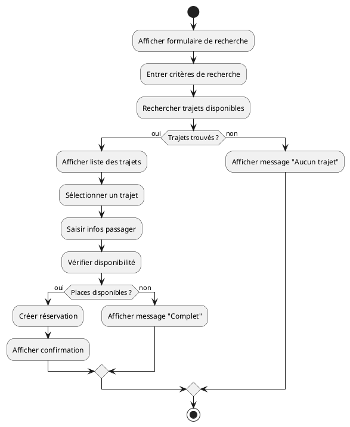
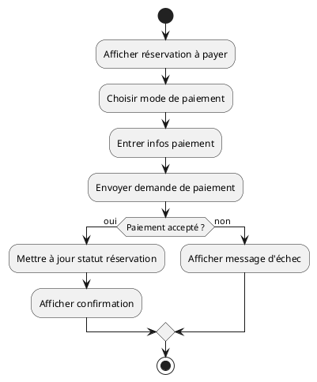
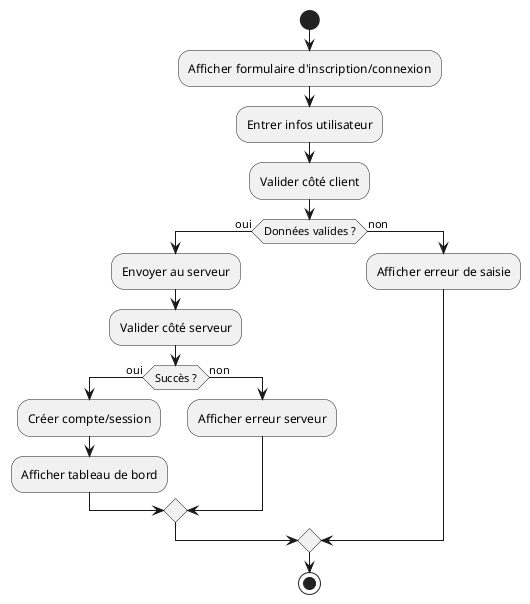
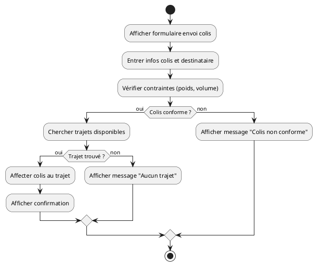
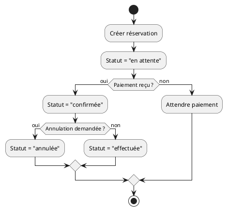

# 🔄 Documentation des Diagrammes d’Activité – BilletTigue

Cette documentation présente l’utilité des diagrammes d’activité pour le projet BilletTigue, propose des exemples de scénarios clés, fournit un exemple de code PlantUML, et explique comment les utiliser pour modéliser les processus métier.

---

## 1. Objectif des diagrammes d’activité

Le diagramme d’activité UML permet de modéliser graphiquement le déroulement d’un processus métier ou d’une fonctionnalité, en représentant les différentes étapes, les décisions, les boucles et les flux parallèles.

Il est particulièrement utile pour :
- Comprendre et optimiser les processus métier complexes
- Décrire les scénarios d’utilisation (réservation, paiement, gestion de profil, etc.)
- Communiquer avec les parties prenantes non techniques

---

## 2. Exemples de scénarios à modéliser

- **Processus de réservation d’un trajet**
- **Processus de paiement d’une réservation**
- **Processus d’inscription et d’authentification**
- **Processus d’envoi de colis**
- **Gestion du cycle de vie d’une réservation (création, paiement, annulation, etc.)**

---

## 3. Exemples de diagrammes d’activité (PlantUML)

### **A. Processus de réservation d’un trajet**

**Description :**
Ce diagramme modélise le processus complet de réservation d’un trajet, avec gestion des cas d’absence de trajet ou de places disponibles.

---

### **B. Processus de paiement d’une réservation**

**Description :**
Ce diagramme décrit le paiement d’une réservation, avec gestion du cas d’échec (paiement refusé, erreur technique).

---

### **C. Processus d’inscription et d’authentification**

**Description :**
Ce diagramme modélise l’inscription ou la connexion, avec gestion des erreurs côté client et serveur.

---

### **D. Processus d’envoi de colis**

**Description :**
Ce diagramme décrit l’envoi d’un colis, avec gestion des contraintes et des cas d’absence de trajet ou de non-conformité du colis.

---

### **E. Cycle de vie d’une réservation**

**Description :**
Ce diagramme modélise le cycle de vie d’une réservation, de la création à la confirmation, l’annulation ou la réalisation, en intégrant les transitions d’état clés.

---

## 4. Bonnes pratiques
- **Clarté** : Utiliser des noms d’étapes explicites et des décisions claires
- **Gestion des exceptions** : Toujours modéliser les cas d’échec ou d’alternative
- **Mise à jour** : Adapter les diagrammes à chaque évolution des processus métier
- **Documentation** : Intégrer les diagrammes dans la documentation projet pour faciliter la communication

---

**Pour chaque processus métier clé, il est recommandé de réaliser un diagramme d’activité et de le documenter dans ce dossier.** 