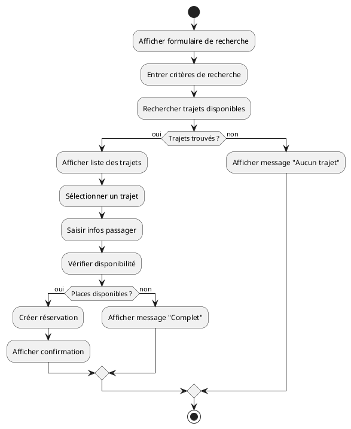

# 🔄 Documentation des Diagrammes d’Activité – BilletTigue

Cette documentation présente l’utilité des diagrammes d’activité pour le projet BilletTigue, propose des exemples de scénarios clés, fournit un exemple de code PlantUML, et explique comment les utiliser pour modéliser les processus métier.

---

## 1. Objectif des diagrammes d’activité

Le diagramme d’activité UML permet de modéliser graphiquement le déroulement d’un processus métier ou d’une fonctionnalité, en représentant les différentes étapes, les décisions, les boucles et les flux parallèles.

Il est particulièrement utile pour :
- Comprendre et optimiser les processus métier complexes
- Décrire les scénarios d’utilisation (réservation, paiement, gestion de profil, etc.)
- Communiquer avec les parties prenantes non techniques

---

## 2. Exemples de scénarios à modéliser

- **Processus de réservation d’un trajet**
- **Processus de paiement d’une réservation**
- **Processus d’inscription et d’authentification**
- **Processus d’envoi de colis**
- **Gestion du cycle de vie d’une réservation (création, paiement, annulation, etc.)**

---

## 3. Exemple de diagramme d’activité (PlantUML)

### **Processus de réservation d’un trajet**

---

## 4. Description du diagramme

Ce diagramme d’activité modélise le processus complet de réservation d’un trajet sur la plateforme BilletTigue :
- L’utilisateur saisit ses critères de recherche
- Le système affiche les trajets disponibles ou un message d’absence
- L’utilisateur sélectionne un trajet, saisit ses informations
- Le système vérifie la disponibilité et crée la réservation si possible
- Les cas d’exception (aucun trajet, trajet complet) sont explicitement gérés

---

## 5. Bonnes pratiques
- **Clarté** : Utiliser des noms d’étapes explicites et des décisions claires
- **Gestion des exceptions** : Toujours modéliser les cas d’échec ou d’alternative
- **Mise à jour** : Adapter les diagrammes à chaque évolution des processus métier
- **Documentation** : Intégrer les diagrammes dans la documentation projet pour faciliter la communication

---

**Pour chaque processus métier clé, il est recommandé de réaliser un diagramme d’activité et de le documenter dans ce dossier.** 