# 📑 Documentation des Diagrammes de Séquence - BilletTigue

Cette documentation décrit les diagrammes de séquence indispensables à réaliser pour le projet BilletTigue. Pour chaque diagramme, sont précisés : le contexte, les acteurs, le scénario à modéliser, les points clés à représenter, une description textuelle détaillée (scénario nominal, scénarios d'exception, explication).

---

## 1. Séquence d’inscription et d’authentification

**Contexte :** Création de compte et connexion pour tous les types d’acteurs (utilisateur, transporteur, administrateur).

**Acteurs :** Utilisateur/Transporteur/Administrateur, Système (Backend/API)

**Scénario à modéliser :**
- Saisie des informations d’inscription ou de connexion
- Validation des données côté client puis côté serveur
- Création du compte ou vérification des identifiants
- Génération et retour du token JWT
- Gestion des erreurs (données invalides, compte existant, etc.)

**Points clés à représenter :**
- Enchaînement des messages entre frontend, backend, base de données
- Gestion des statuts de réponse (succès/échec)
- Stockage du token côté client

**Description détaillée :**
- **Scénario nominal :** L'utilisateur saisit ses informations (inscription ou connexion). Les données sont validées côté client puis envoyées au backend. Le backend vérifie (ou crée) le compte dans la base de données. Si tout est correct, un token JWT est généré et renvoyé au frontend, qui le stocke et affiche la réussite à l'utilisateur.
- **Scénarios d'exception :**
  - Données invalides côté client (ex : email mal formé, mot de passe trop court) : message d'erreur immédiat.
  - Données invalides côté serveur (ex : email déjà utilisé, mot de passe incorrect) : message d'erreur renvoyé par l'API.
  - Problème de connexion à la base de données ou erreur serveur : message d'erreur générique.
- **Explication :** Ce diagramme illustre la robustesse du processus d'authentification, la gestion des erreurs à chaque étape et la sécurisation de la session utilisateur via JWT.

**Illustration :**
```mermaid
sequenceDiagram
actor U as "Utilisateur"
participant F as "Frontend"
participant B as "Backend/API"
participant DB as "Base de données"
U->>F: Saisie des infos d'inscription/connexion
F->>B: Envoie des données
B->>DB: Vérifie/crée le compte
DB-->>B: Résultat (succès/échec)
B-->>F: Token JWT ou erreur
F-->>U: Affiche le résultat, stocke le token
```

---

## 2. Séquence de réservation d’un trajet

**Contexte :** Processus de réservation d’un trajet par un utilisateur.

**Acteurs :** Utilisateur, Système (Frontend, Backend), Transporteur

**Scénario à modéliser :**
- Recherche de trajets disponibles
- Sélection d’un trajet
- Saisie des informations de réservation
- Validation des disponibilités
- Création de la réservation
- Notification du transporteur

**Points clés à représenter :**
- Appels API pour la recherche et la réservation
- Vérification des disponibilités en temps réel
- Création de la réservation en base
- Notification (email, push, etc.)

**Description détaillée :**
- **Scénario nominal :** L'utilisateur recherche des trajets, sélectionne celui qui l'intéresse, saisit les informations nécessaires et valide la réservation. Le backend vérifie la disponibilité, crée la réservation et notifie le transporteur. L'utilisateur reçoit une confirmation.
- **Scénarios d'exception :**
  - Aucun trajet disponible : message d'information à l'utilisateur.
  - Trajet sélectionné complet ou plus disponible : message d'erreur lors de la validation.
  - Erreur lors de la création de la réservation (ex : problème base de données) : message d'échec.
- **Explication :** Ce diagramme montre l'enchaînement des interactions pour garantir la cohérence des réservations, la gestion des disponibilités et la notification des parties prenantes.

**Illustration :**
```mermaid
sequenceDiagram
actor U as "Utilisateur"
participant F as "Frontend"
participant B as "Backend/API"
participant DB as "Base de données"
participant T as "Transporteur"
U->>F: Recherche de trajets
F->>B: Requête API trajets
B->>DB: Recherche trajets disponibles
DB-->>B: Liste trajets
B-->>F: Résultats
F-->>U: Affiche les trajets
U->>F: Sélectionne un trajet, saisit infos
F->>B: Demande réservation
B->>DB: Vérifie disponibilité, crée réservation
DB-->>B: Confirmation
B-->>T: Notification nouvelle réservation
B-->>F: Confirmation à l'utilisateur
F-->>U: Affiche confirmation
```

---

## 3. Séquence de paiement d’une réservation

**Contexte :** Paiement d’une réservation par l’utilisateur.

**Acteurs :** Utilisateur, Système, Service de paiement externe, Transporteur

**Scénario à modéliser :**
- Demande de paiement depuis l’interface utilisateur
- Transmission des informations au service de paiement (ex : Stripe)
- Validation ou refus du paiement
- Mise à jour du statut de la réservation
- Notification du transporteur et de l’utilisateur

**Points clés à représenter :**
- Sécurité des échanges (données sensibles)
- Gestion des statuts de paiement (en attente, payé, échec)
- Synchronisation entre le service externe et la base de données

**Description détaillée :**
- **Scénario nominal :** L'utilisateur initie le paiement, le backend transmet la demande au service de paiement. Si le paiement est validé, le statut de la réservation est mis à jour et le transporteur est notifié. L'utilisateur reçoit une confirmation.
- **Scénarios d'exception :**
  - Paiement refusé (fonds insuffisants, carte invalide, etc.) : message d'échec à l'utilisateur, réservation non confirmée.
  - Problème de communication avec le service de paiement : message d'erreur, possibilité de réessayer.
  - Erreur lors de la mise à jour du statut en base : message d'erreur, paiement peut être débité mais réservation non validée (à traiter manuellement).
- **Explication :** Ce diagramme met en avant la sécurité des transactions, la gestion des statuts et la synchronisation entre les systèmes internes et externes.

**Illustration :**
```mermaid
sequenceDiagram
actor U as "Utilisateur"
participant F as "Frontend"
participant B as "Backend/API"
participant P as "Service Paiement"
participant DB as "Base de données"
participant T as "Transporteur"
U->>F: Clique sur "Payer"
F->>B: Demande de paiement
B->>P: Transmet infos paiement
P-->>B: Réponse (succès/échec)
B->>DB: Met à jour statut réservation
B-->>T: Notification paiement reçu
B-->>F: Confirmation à l'utilisateur
F-->>U: Affiche résultat
```

---

## 4. Séquence de gestion de profil

**Contexte :** Modification des informations de profil par un utilisateur, un transporteur ou un administrateur.

**Acteurs :** Utilisateur/Transporteur/Administrateur, Système

**Scénario à modéliser :**
- Saisie des nouvelles informations
- Validation côté client et serveur
- Mise à jour en base de données
- Retour d’information à l’utilisateur

**Points clés à représenter :**
- Gestion des erreurs de validation
- Confirmation de la mise à jour

**Description détaillée :**
- **Scénario nominal :** L'utilisateur modifie ses informations de profil, qui sont validées puis enregistrées en base. Un message de confirmation est affiché.
- **Scénarios d'exception :**
  - Données invalides (ex : email déjà utilisé, format incorrect) : message d'erreur.
  - Erreur lors de la mise à jour en base : message d'échec, modification non prise en compte.
- **Explication :** Ce diagramme montre la simplicité et la robustesse du processus de modification de profil, avec gestion des erreurs et retour utilisateur.

**Illustration :**
```mermaid
sequenceDiagram
actor U as "Utilisateur/Transporteur/Admin"
participant F as "Frontend"
participant B as "Backend/API"
participant DB as "Base de données"
U->>F: Modifie infos profil
F->>B: Envoie nouvelles infos
B->>DB: Met à jour profil
DB-->>B: Confirmation
B-->>F: Résultat (succès/erreur)
F-->>U: Affiche confirmation
```

---

## 5. Séquence de gestion des trajets (Transporteur)

**Contexte :** Création, modification ou suppression d’un trajet par un transporteur.

**Acteurs :** Transporteur, Système

**Scénario à modéliser :**
- Saisie ou modification des informations du trajet
- Validation des données
- Création, mise à jour ou suppression en base
- Retour d’information à l’utilisateur

**Points clés à représenter :**
- Gestion des statuts des trajets (actif, en attente, terminé)
- Vérification des conflits de dates ou de disponibilités

**Description détaillée :**
- **Scénario nominal :** Le transporteur saisit ou modifie un trajet, les données sont validées puis enregistrées en base. Un message de confirmation est affiché.
- **Scénarios d'exception :**
  - Données invalides (ex : dates incohérentes, nombre de places négatif) : message d'erreur.
  - Conflit de disponibilité (trajet déjà existant, chevauchement) : message d'erreur spécifique.
  - Erreur lors de la mise à jour en base : message d'échec.
- **Explication :** Ce diagramme met en avant la gestion des statuts, la validation métier et la robustesse du processus de gestion des trajets.

**Illustration :**
```mermaid
sequenceDiagram
actor T as "Transporteur"
participant F as "Frontend"
participant B as "Backend/API"
participant DB as "Base de données"
T->>F: Saisie/modification trajet
F->>B: Envoie infos trajet
B->>DB: Crée/modifie/supprime trajet
DB-->>B: Confirmation
B-->>F: Résultat (succès/erreur)
F-->>T: Affiche confirmation
```

---

## 6. Séquence de gestion des colis (optionnel)

**Contexte :** Demande d’envoi de colis par un utilisateur, gestion par le transporteur.

**Acteurs :** Utilisateur, Transporteur, Système

**Scénario à modéliser :**
- Saisie de la demande d’envoi
- Validation et affectation à un trajet
- Notification du transporteur

**Points clés à représenter :**
- Vérification des contraintes (poids, volume, disponibilité)
- Suivi de l’état du colis

**Description détaillée :**
- **Scénario nominal :** L'utilisateur saisit une demande d'envoi de colis, le backend vérifie les contraintes et affecte le colis à un trajet disponible. Le transporteur est notifié et l'utilisateur reçoit une confirmation.
- **Scénarios d'exception :**
  - Colis non conforme (poids/volume dépassé) : message d'erreur.
  - Aucun trajet disponible pour le colis : message d'information.
  - Erreur lors de l'affectation ou de la notification : message d'échec.
- **Explication :** Ce diagramme illustre la gestion logistique des colis, la validation métier et la notification des acteurs concernés.

**Illustration :**
```mermaid
sequenceDiagram
actor U as "Utilisateur"
participant F as "Frontend"
participant B as "Backend/API"
participant DB as "Base de données"
participant T as "Transporteur"
U->>F: Demande d'envoi de colis
F->>B: Envoie infos colis
B->>DB: Vérifie contraintes, affecte à un trajet
DB-->>B: Confirmation
B-->>T: Notification nouveau colis
B-->>F: Confirmation à l'utilisateur
F-->>U: Affiche confirmation
```

---

## 7. Séquence d’administration (modération, gestion utilisateurs/transporteurs)

**Contexte :** Actions d’administration sur les comptes et les droits.

**Acteurs :** Administrateur, Système

**Scénario à modéliser :**
- Suspension, désactivation, modification de comptes
- Gestion des droits et notifications

**Points clés à représenter :**
- Traçabilité des actions
- Gestion des notifications et des logs

**Description détaillée :**
- **Scénario nominal :** L'administrateur effectue une action (suspension, modification, etc.), le backend met à jour la base, notifie les utilisateurs concernés et log l'action. Un message de confirmation est affiché.
- **Scénarios d'exception :**
  - Action non autorisée (droits insuffisants) : message d'erreur.
  - Erreur lors de la mise à jour ou de la notification : message d'échec, action loggée pour audit.
- **Explication :** Ce diagramme met en avant la sécurité, la traçabilité et la gouvernance des actions d'administration sur la plateforme.

**Illustration :**
```mermaid
sequenceDiagram
actor A as "Administrateur"
participant F as "Frontend"
participant B as "Backend/API"
participant DB as "Base de données"
A->>F: Action admin (suspendre, modifier...)
F->>B: Envoie requête admin
B->>DB: Met à jour compte/droits
DB-->>B: Confirmation
B-->>F: Résultat (succès/erreur)
F-->>A: Affiche confirmation
B-->>DB: Log action admin
```

---

## Conseils de réalisation
- Pour chaque diagramme, représenter clairement les messages, validations, retours d’erreur et mises à jour d’état.
- Utiliser des outils UML (draw.io, Lucidchart, StarUML) pour la modélisation.
- Conserver les diagrammes dans le dossier `docs/uml/` du projet. 

---

### 1. Inscription et Authentification
```plantuml
@startuml
actor Utilisateur as U
participant "Frontend" as F
participant "Backend/API" as B
database "Base de données" as DB

U -> F : Saisie des infos d'inscription/connexion
F -> B : Envoie des données
B -> DB : Vérifie/crée le compte
DB --> B : Résultat (succès/échec)
B --> F : Token JWT ou erreur
F --> U : Affiche le résultat, stocke le token
@enduml
```

---

### 2. Réservation d’un trajet
```plantuml
@startuml
actor Utilisateur as U
participant "Frontend" as F
participant "Backend/API" as B
database "Base de données" as DB
participant "Transporteur" as T

U -> F : Recherche de trajets
F -> B : Requête API trajets
B -> DB : Recherche trajets disponibles
DB --> B : Liste trajets
B --> F : Résultats
F --> U : Affiche les trajets
U -> F : Sélectionne un trajet, saisit infos
F -> B : Demande réservation
B -> DB : Vérifie disponibilité, crée réservation
DB --> B : Confirmation
B -> T : Notification nouvelle réservation
B --> F : Confirmation à l'utilisateur
F --> U : Affiche confirmation
@enduml
```

---

### 3. Paiement d’une réservation
```plantuml
@startuml
actor Utilisateur as U
participant "Frontend" as F
participant "Backend/API" as B
participant "Service Paiement" as P
database "Base de données" as DB
participant "Transporteur" as T

U -> F : Clique sur "Payer"
F -> B : Demande de paiement
B -> P : Transmet infos paiement
P --> B : Réponse (succès/échec)
B -> DB : Met à jour statut réservation
B -> T : Notification paiement reçu
B --> F : Confirmation à l'utilisateur
F --> U : Affiche résultat
@enduml
```

---

### 4. Gestion de profil
```plantuml
@startuml
actor "Utilisateur/Transporteur/Admin" as U
participant "Frontend" as F
participant "Backend/API" as B
database "Base de données" as DB

U -> F : Modifie infos profil
F -> B : Envoie nouvelles infos
B -> DB : Met à jour profil
DB --> B : Confirmation
B --> F : Résultat (succès/erreur)
F --> U : Affiche confirmation
@enduml
```

---

### 5. Gestion des trajets (Transporteur)
```plantuml
@startuml
actor Transporteur as T
participant "Frontend" as F
participant "Backend/API" as B
database "Base de données" as DB

T -> F : Saisie/modification trajet
F -> B : Envoie infos trajet
B -> DB : Crée/modifie/supprime trajet
DB --> B : Confirmation
B --> F : Résultat (succès/erreur)
F --> T : Affiche confirmation
@enduml
```

---

### 6. Gestion des colis (optionnel)
```plantuml
@startuml
actor Utilisateur as U
participant "Frontend" as F
participant "Backend/API" as B
database "Base de données" as DB
participant "Transporteur" as T

U -> F : Demande d'envoi de colis
F -> B : Envoie infos colis
B -> DB : Vérifie contraintes, affecte à un trajet
DB --> B : Confirmation
B -> T : Notification nouveau colis
B --> F : Confirmation à l'utilisateur
F --> U : Affiche confirmation
@enduml
```

---

### 7. Administration (modération, gestion comptes)
```plantuml
@startuml
actor Administrateur as A
participant "Frontend" as F
participant "Backend/API" as B
database "Base de données" as DB

A -> F : Action admin (suspendre, modifier...)
F -> B : Envoie requête admin
B -> DB : Met à jour compte/droits
DB --> B : Confirmation
B --> F : Résultat (succès/erreur)
F --> A : Affiche confirmation
B -> DB : Log action admin
@enduml
```

---

**Si tu veux que je les ajoute à un fichier ou à la documentation, dis-le-moi !** 