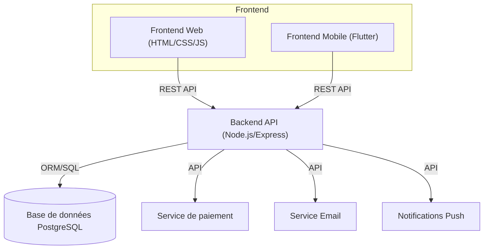
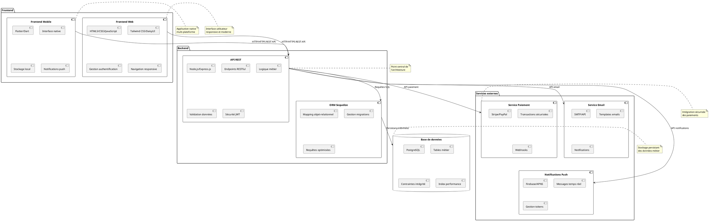

# 🧩 Documentation du Diagramme de Composants – BilletTigue

Cette documentation présente le diagramme de composants du projet BilletTigue, en expliquant les principaux modules logiciels, leurs responsabilités et leurs interactions.

---

## 1. Objectif du diagramme de composants

Le diagramme de composants UML permet de visualiser l'architecture logicielle du projet, la répartition des responsabilités entre les modules, et les points d'intégration entre les différentes couches (backend, frontend web, frontend mobile, base de données, API, etc.).

---

## 2. Composants principaux du projet

### **A. Backend (API REST)**
- **Technologies :** Node.js, Express.js, Sequelize, PostgreSQL
- **Responsabilités :**
  - Exposer des endpoints RESTful pour toutes les fonctionnalités métier (authentification, réservation, gestion des trajets, paiements, envois, etc.)
  - Gérer la logique métier, la sécurité, la validation et la persistance des données
  - Communiquer avec la base de données

### **B. Base de données**
- **Technologie :** PostgreSQL
- **Responsabilités :**
  - Stocker toutes les données métier (utilisateurs, comptes, trajets, réservations, paiements, envois, etc.)
  - Assurer l'intégrité, la cohérence et la sécurité des données

### **C. Frontend Web**
- **Technologies :** HTML5, CSS3, JavaScript, Tailwind CSS, DaisyUI
- **Responsabilités :**
  - Offrir une interface utilisateur moderne et responsive pour les utilisateurs, transporteurs et administrateurs
  - Consommer l'API backend pour toutes les opérations métier
  - Gérer l'authentification, la navigation, l'affichage dynamique et la validation côté client

### **D. Frontend Mobile**
- **Technologies :** Flutter, Dart
- **Responsabilités :**
  - Proposer une application mobile native pour les utilisateurs et transporteurs
  - Consommer l'API backend pour la réservation, la gestion de profil, la consultation des trajets, etc.
  - Gérer l'authentification, la navigation mobile, le stockage local et les notifications

### **E. Services externes (optionnels)**
- **Exemples :** Service de paiement (Stripe, PayPal), service d'email, notifications push
- **Responsabilités :**
  - Gérer les transactions financières, l'envoi d'emails, les notifications en temps réel
  - S'intégrer via des API sécurisées avec le backend

---

## 3. Interactions entre composants

- **Frontend Web & Mobile → Backend :**
  - Appels HTTP/HTTPS (REST API) pour toutes les opérations (authentification, réservation, gestion de profil, etc.)
- **Backend → Base de données :**
  - Requêtes SQL via ORM (Sequelize) pour la persistance et la lecture des données
- **Backend → Services externes :**
  - Appels API pour les paiements, emails, notifications
- **Frontend Web ↔ Frontend Mobile :**
  - Pas d'interaction directe, mais logique métier et modèles de données cohérents

---

## 4. Exemple d'illustration (Mermaid)

---

## 5. Diagramme de composants PlantUML

### **Code PlantUML :**

### **Description du diagramme :**

Ce diagramme de composants UML représente l'architecture logicielle complète du projet BilletTigue, organisée en plusieurs packages :

1. **Package Frontend :** Contient les interfaces utilisateur
   - **Frontend Web :** Application web responsive utilisant HTML5, CSS3, JavaScript avec Tailwind CSS et DaisyUI pour le styling
   - **Frontend Mobile :** Application mobile native développée avec Flutter/Dart

2. **Package Backend :** Contient la logique métier et l'API
   - **API REST :** Serveur Node.js/Express.js exposant les endpoints RESTful
   - **ORM Sequelize :** Couche d'abstraction pour la gestion de la base de données

3. **Base de données :** Stockage persistant PostgreSQL avec les tables métier

4. **Package Services externes :** Intégrations tierces
   - **Service Paiement :** Gestion des transactions financières
   - **Service Email :** Envoi d'emails et notifications
   - **Notifications Push :** Messages en temps réel

### **Explication des relations :**

- **Flèches unidirectionnelles :** Montrent le sens des appels (client → serveur)
- **Protocoles spécifiés :** HTTP/HTTPS pour les API, SQL pour la base de données
- **Séparation des responsabilités :** Chaque composant a un rôle bien défini
- **Évolutivité :** Architecture modulaire permettant l'ajout de nouveaux services

---

## 6. Bonnes pratiques et évolutivité
- **Modularité :** Chaque composant doit être indépendant et facilement remplaçable ou extensible.
- **Sécurité :** Les échanges entre composants doivent être sécurisés (HTTPS, authentification, validation).
- **Scalabilité :** L'architecture permet d'ajouter de nouveaux services (paiement, analytics, etc.) sans refonte majeure.
- **Documentation :** Le diagramme doit être mis à jour à chaque évolution majeure de l'architecture.

---

**Pour toute modification de l'architecture, pensez à mettre à jour ce diagramme et la documentation associée.** 