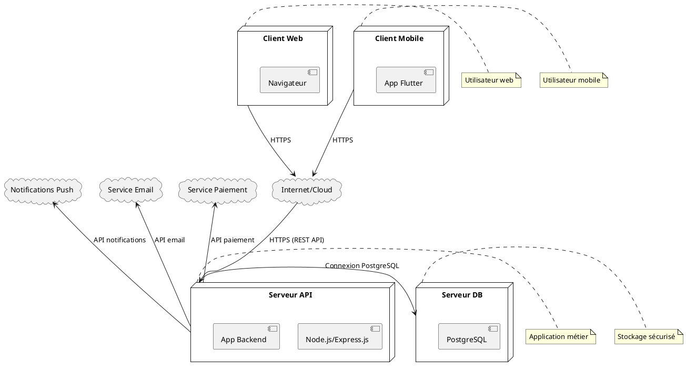

# 🚀 Documentation du Diagramme de Déploiement – BilletTigue

Cette documentation présente le diagramme de déploiement du projet BilletTigue, en expliquant l’architecture d’hébergement, les nœuds physiques/virtuels, les artefacts déployés et les flux de communication.

---

## 1. Objectif du diagramme de déploiement

Le diagramme de déploiement UML permet de visualiser l’infrastructure technique du projet, la répartition des composants logiciels sur les serveurs, et les interactions réseau entre les différents éléments (serveur backend, base de données, clients web/mobile, services externes, etc.).

---

## 2. Composants et nœuds principaux du déploiement

- **Clients Web** : Navigateurs des utilisateurs finaux (PC, tablette, mobile)
- **Clients Mobile** : Applications mobiles installées sur les smartphones/tablettes
- **Serveur Web/API** : Héberge l’application backend Node.js/Express.js (API REST)
- **Serveur de base de données** : Héberge la base PostgreSQL
- **Services externes** : Plateformes tierces (paiement, email, notifications push)
- **Internet/Cloud** : Réseau public assurant la connectivité

---

## 3. Interactions et flux réseau

- Les clients (web et mobile) communiquent avec le serveur API via HTTPS (REST)
- Le serveur API communique avec la base de données via un réseau privé sécurisé (port PostgreSQL)
- Le serveur API interagit avec les services externes via Internet (API sécurisées)
- Les notifications push sont envoyées via des services cloud (Firebase, APNS, etc.)

---

## 4. Exemple d’illustration PlantUML

---

## 5. Description du diagramme

Ce diagramme de déploiement UML représente l’infrastructure technique du projet BilletTigue :

- Les clients web et mobiles accèdent à l’application via Internet (HTTPS)
- Le serveur API (Node.js/Express.js) est hébergé sur un serveur dédié ou cloud (ex : AWS EC2, Heroku, VPS)
- La base de données PostgreSQL est hébergée sur un serveur séparé ou un service managé (ex : AWS RDS)
- Les services externes (paiement, email, notifications) sont accessibles via Internet
- Les flux de données sont sécurisés (HTTPS, ports restreints)

---

## 6. Bonnes pratiques et recommandations
- **Sécurité réseau :** Utiliser HTTPS partout, restreindre les ports ouverts, firewall strict
- **Isolation :** Séparer les serveurs API et base de données pour la sécurité et la performance
- **Scalabilité :** Prévoir la possibilité de répliquer ou d’étendre les serveurs (load balancer, cluster DB)
- **Surveillance :** Mettre en place du monitoring (logs, alertes, supervision)
- **Sauvegardes :** Planifier des backups réguliers de la base de données
- **Documentation :** Mettre à jour le diagramme à chaque évolution de l’infrastructure

---

**Pour toute modification de l’infrastructure, pensez à mettre à jour ce diagramme et la documentation associée.** 