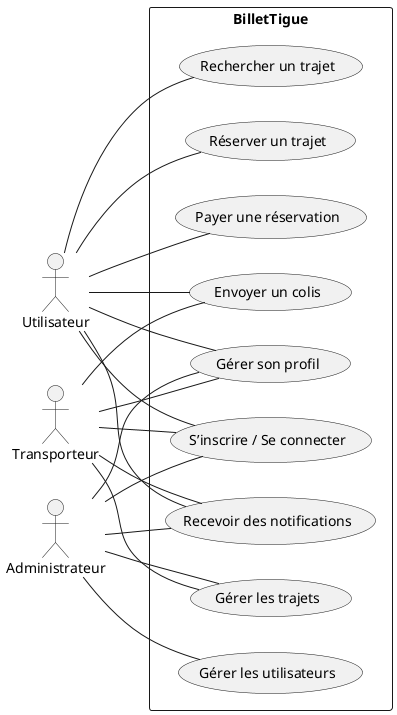
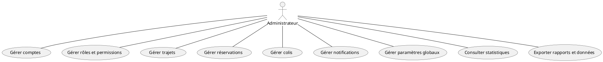
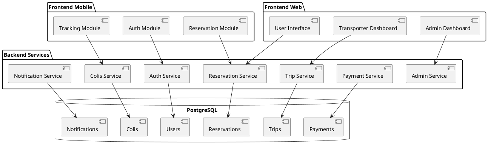

# 🎯 Documentation du Diagramme de Cas d’Utilisation (Use Case) – BilletTigue

Cette documentation présente l’utilité du diagramme de cas d’utilisation pour le projet BilletTigue, propose des exemples de cas d’utilisation majeurs, fournit un exemple de code PlantUML, et explique comment l’utiliser pour modéliser les interactions entre acteurs et système.

---

## 1. Objectif du diagramme de cas d’utilisation

Le diagramme de cas d’utilisation UML permet de représenter graphiquement les interactions entre les différents acteurs (utilisateur, transporteur, administrateur) et le système, en identifiant les fonctionnalités principales accessibles à chaque acteur.

Il est particulièrement utile pour :
- Définir le périmètre fonctionnel du projet
- Communiquer avec les parties prenantes (techniques et non techniques)
- Identifier les scénarios métier à implémenter

---

## 2. Exemples de cas d’utilisation majeurs

- **S’inscrire et se connecter**
- **Rechercher un trajet**
- **Réserver un trajet**
- **Payer une réservation**
- **Gérer son profil**
- **Envoyer un colis**
- **Gérer les trajets (transporteur)**
- **Gérer les utilisateurs et transporteurs (admin)**
- **Recevoir des notifications**

---

## 3. Exemple de diagramme de cas d’utilisation (PlantUML)



---

## 4. Description du diagramme

Ce diagramme de cas d’utilisation UML modélise les principales interactions entre les acteurs et la plateforme BilletTigue :
- **Utilisateur** : Peut s’inscrire, rechercher/réserver/payer un trajet, gérer son profil, envoyer un colis, recevoir des notifications
- **Transporteur** : Peut s’inscrire, gérer son profil, gérer les trajets, envoyer des colis, recevoir des notifications
- **Administrateur** : Peut s’inscrire, gérer son profil, gérer les trajets, gérer les utilisateurs/transporteurs, recevoir des notifications

Chaque cas d’utilisation représente une fonctionnalité clé du système, accessible à un ou plusieurs acteurs.

---

## 4.bis. Cas d’utilisation globalisés pour l’administrateur

Voici les cas d’utilisation principaux que l’administrateur peut réaliser sur la plateforme :

- Gérer comptes (création, validation, suspension, suppression des comptes transporteurs et utilisateurs)
- Gérer rôles et permissions
- Gérer trajets (création, modification, suppression, validation, consultation)
- Gérer réservations (consultation, annulation)
- Gérer colis (consultation, gestion des litiges)
- Gérer notifications (création, envoi, consultation)
- Gérer paramètres globaux
- Consulter statistiques
- Exporter rapports et données

**Diagramme PlantUML correspondant :**



---

## 5. Bonnes pratiques
- **Clarté** : Utiliser des noms explicites pour chaque cas d’utilisation
- **Exhaustivité** : Couvrir tous les scénarios métier importants
- **Mise à jour** : Adapter le diagramme à chaque évolution du périmètre fonctionnel
- **Documentation** : Intégrer le diagramme dans la documentation projet pour faciliter la communication

---

**Pour chaque évolution fonctionnelle majeure, il est recommandé de mettre à jour le diagramme de cas d’utilisation et la documentation associée.** 

# Chapitre 4 – Conception technique et architecture logicielle

## 1. Architecture 3-tiers

### 1.1 Schéma global et justification du choix

L'architecture 3-tiers adoptée pour BilletTiguè sépare clairement les responsabilités entre trois couches distinctes :

```
┌─────────────────────────────────────────────────────────────┐
│                    TIER PRÉSENTATION                      │
│  ┌─────────────────┐  ┌─────────────────┐                │
│  │   Application   │  │   Frontend Web  │                │
│  │   Mobile        │  │   (React/HTML)  │                │
│  │   (Flutter)     │  │                 │                │
│  └─────────────────┘  └─────────────────┘                │
└─────────────────────────────────────────────────────────────┘
                              │
                              │ API REST/WebSocket
                              ▼
┌─────────────────────────────────────────────────────────────┐
│                   TIER LOGIQUE MÉTIER                     │
│  ┌─────────────────┐  ┌─────────────────┐                │
│  │   Contrôleurs   │  │    Services     │                │
│  │   (Express)     │  │   (Business     │                │
│  │                 │  │    Logic)       │                │
│  └─────────────────┘  └─────────────────┘                │
└─────────────────────────────────────────────────────────────┘
                              │
                              │ ORM (Sequelize)
                              ▼
┌─────────────────────────────────────────────────────────────┐
│                     TIER DONNÉES                          │
│  ┌─────────────────────────────────────────────────────┐   │
│  │              Base de données                       │   │
│  │              PostgreSQL                            │   │
│  └─────────────────────────────────────────────────────┘   │
└─────────────────────────────────────────────────────────────┘
```

**Justification du choix :**

- **Séparation des responsabilités** : Chaque tier a un rôle précis et peut évoluer indépendamment
- **Scalabilité** : Possibilité d'ajouter de nouveaux clients (web, mobile, API) sans modifier la logique métier
- **Maintenabilité** : Code organisé et modulaire facilitant la maintenance
- **Sécurité** : Contrôle centralisé des accès et de la validation des données
- **Réutilisabilité** : Services métier réutilisables par différents clients

**Avantages :**
- Flexibilité dans le choix des technologies frontend
- Isolation des préoccupations métier
- Facilité de test et de déploiement
- Support multi-plateformes (web, mobile)

**Inconvénients :**
- Complexité de gestion des sessions distribuées
- Latence réseau entre les tiers
- Dépendance à la connectivité réseau

### 1.2 Pattern MVC dans chaque tier

#### 1.2.1 Frontend Mobile (Flutter)

**Structure MVC :**
```
lib/
├── models/          # Modèles de données
│   ├── user.dart
│   ├── trip.dart
│   └── reservation.dart
├── views/           # Vues (Widgets)
│   ├── screens/
│   └── widgets/
└── controllers/     # Contrôleurs
    ├── auth_controller.dart
    ├── trip_controller.dart
    └── reservation_controller.dart
```

**Composants :**
- **Models** : Classes Dart représentant les entités métier
- **Views** : Widgets Flutter pour l'interface utilisateur
- **Controllers** : Gestion de l'état et communication avec l'API

**Justification technique :**
- Séparation claire entre logique métier et interface
- Facilité de test des composants
- Réutilisabilité des widgets

#### 1.2.2 Frontend Web (React/HTML)

**Structure MVC :**
```
src/
├── models/          # Modèles de données (TypeScript interfaces)
├── views/           # Composants React
│   ├── components/
│   └── pages/
└── controllers/     # Hooks et services
    ├── hooks/
    └── services/
```

**Composants :**
- **Models** : Interfaces TypeScript et types de données
- **Views** : Composants React pour l'affichage
- **Controllers** : Hooks personnalisés et services API

**Justification technique :**
- Architecture moderne et performante
- Gestion d'état centralisée
- Composants réutilisables

#### 1.2.3 Backend (Node.js/Express)

**Structure MVC :**
```
backend/
├── models/          # Modèles Sequelize
├── views/           # Templates (emails, notifications)
├── controllers/     # Contrôleurs Express
├── services/        # Logique métier
└── middlewares/     # Middlewares (auth, validation)
```

**Composants :**
- **Models** : Définitions Sequelize des entités
- **Views** : Templates pour emails et notifications
- **Controllers** : Gestion des requêtes HTTP
- **Services** : Logique métier réutilisable

**Justification technique :**
- Séparation claire entre couche API et logique métier
- Facilité de test et maintenance
- Réutilisabilité des services

## 2. Structuration fonctionnelle et sécurité

### 2.1 Modules/services fonctionnels

**Modules identifiés :**

1. **Module Authentification**
   - Gestion des comptes utilisateurs/transporteurs
   - Authentification JWT
   - Gestion des rôles et permissions

2. **Module Réservation**
   - Recherche de trajets
   - Création/modification/annulation de réservations
   - Gestion des paiements

3. **Module Expédition**
   - Gestion des colis
   - Suivi des livraisons
   - Gestion des litiges

4. **Module Transporteurs**
   - Création/gestion de trajets
   - Gestion des réservations reçues
   - Statistiques personnelles

5. **Module Administration**
   - Supervision globale
   - Gestion des utilisateurs
   - Rapports et exports

### 2.2 Diagramme de composants



### 2.3 Interfaces REST/WebSocket

**API REST Endpoints :**
```
Authentication:
POST   /api/auth/login
POST   /api/auth/register
POST   /api/auth/logout
POST   /api/auth/refresh

Reservations:
GET    /api/reservations
POST   /api/reservations
PUT    /api/reservations/:id
DELETE /api/reservations/:id

Trips:
GET    /api/trips
POST   /api/trips
PUT    /api/trips/:id
DELETE /api/trips/:id

Colis:
GET    /api/colis
POST   /api/colis
PUT    /api/colis/:id
DELETE /api/colis/:id
```

**WebSocket Events :**
```
Real-time updates:
- reservation.created
- trip.updated
- colis.status_changed
- notification.new
```

## 3. Stratégie de sécurité complète

### 3.1 Authentification et autorisation

**JWT (JSON Web Tokens) :**
```javascript
// Structure du token
{
  "header": {
    "alg": "HS256",
    "typ": "JWT"
  },
  "payload": {
    "sub": "user_id",
    "role": "user|transporter|admin",
    "iat": 1516239022,
    "exp": 1516239922
  }
}
```

**Refresh Tokens :**
- Stockage sécurisé côté client
- Rotation automatique des tokens
- Blacklist des tokens révoqués

**RBAC (Role-Based Access Control) :**
```javascript
const roles = {
  user: ['read:own_reservations', 'create:reservations'],
  transporter: ['read:own_trips', 'create:trips', 'manage:reservations'],
  admin: ['read:all', 'write:all', 'delete:all']
};
```

### 3.2 Chiffrement et protection des données

**En transit (SSL/TLS) :**
- Certificats SSL/TLS obligatoires
- Configuration HSTS (HTTP Strict Transport Security)
- Chiffrement TLS 1.3 recommandé

**Au repos :**
- Chiffrement des mots de passe avec bcrypt (salt rounds: 12)
- Chiffrement des données sensibles en base
- Gestion sécurisée des clés de chiffrement

**Gestion des secrets :**
```javascript
// Utilisation d'variables d'environnement
const config = {
  jwtSecret: process.env.JWT_SECRET,
  dbPassword: process.env.DB_PASSWORD,
  apiKey: process.env.API_KEY
};
```

### 3.3 Protection OWASP

**XSS (Cross-Site Scripting) :**
- Validation et échappement des entrées utilisateur
- Content Security Policy (CSP)
- Utilisation de frameworks sécurisés

**CSRF (Cross-Site Request Forgery) :**
- Tokens CSRF sur les formulaires
- Validation des origines des requêtes
- Headers de sécurité appropriés

**Injection SQL :**
- Utilisation d'ORM (Sequelize) avec paramètres préparés
- Validation stricte des entrées
- Échappement des caractères spéciaux

**CORS (Cross-Origin Resource Sharing) :**
```javascript
const corsOptions = {
  origin: ['https://billetigue.com', 'https://app.billetigue.com'],
  credentials: true,
  methods: ['GET', 'POST', 'PUT', 'DELETE'],
  allowedHeaders: ['Content-Type', 'Authorization']
};
```

**Headers de sécurité :**
```javascript
app.use(helmet({
  contentSecurityPolicy: {
    directives: {
      defaultSrc: ["'self'"],
      styleSrc: ["'self'", "'unsafe-inline'"],
      scriptSrc: ["'self'"]
    }
  }
}));
```

### 3.4 Plan de sauvegarde et reprise

**Sauvegarde :**
- Sauvegarde automatique quotidienne
- Sauvegarde incrémentale toutes les heures
- Stockage sécurisé hors site
- Test de restauration mensuel

**Restauration :**
- Procédure de restauration documentée
- Temps de récupération cible : 4 heures
- Point de reprise cible : 1 heure

**Reprise après sinistre :**
- Plan de continuité d'activité
- Infrastructure de secours
- Procédures d'urgence documentées

## 4. Déploiement et maintenance (Optionnel)

### 4.1 Conteneurisation

**Docker Compose :**
```yaml
version: '3.8'
services:
  backend:
    build: ./backend
    ports:
      - "3000:3000"
    environment:
      - NODE_ENV=production
    depends_on:
      - postgres
      
  frontend:
    build: ./web
    ports:
      - "80:80"
      
  postgres:
    image: postgres:13
    environment:
      POSTGRES_DB: billettigue
      POSTGRES_PASSWORD: ${DB_PASSWORD}
    volumes:
      - postgres_data:/var/lib/postgresql/data
```

### 4.2 CI/CD Pipeline

**GitHub Actions :**
```yaml
name: CI/CD Pipeline
on:
  push:
    branches: [main]
    
jobs:
  test:
    runs-on: ubuntu-latest
    steps:
      - uses: actions/checkout@v2
      - name: Run tests
        run: npm test
        
  deploy:
    needs: test
    runs-on: ubuntu-latest
    steps:
      - name: Deploy to production
        run: |
          docker-compose up -d
```

### 4.3 Monitoring et logging

**Monitoring :**
- Prometheus pour les métriques
- Grafana pour la visualisation
- Alertes automatiques

**Logging :**
- Winston pour les logs structurés
- Centralisation avec ELK Stack
- Rotation automatique des logs

### 4.4 Scalabilité

**Scalabilité horizontale :**
- Load balancer (Nginx)
- Réplication de base de données
- Cache Redis pour les sessions

**Scalabilité verticale :**
- Monitoring des ressources
- Auto-scaling basé sur la charge
- Optimisation des requêtes

---

**Références et normes :**
- OWASP Top 10 (2021)
- NIST Cybersecurity Framework
- ISO 27001 (Sécurité de l'information)
- RFC 7519 (JWT)
- RFC 6749 (OAuth 2.0) 